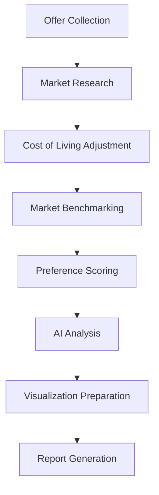

# OfferCompare Pro - Intelligent Job Offer Analysis Platform

<div align="center">


**AI-Powered Career Decision Support Tool**

[](https://www.python.org/downloads/)
[](https://github.com/The-Pocket/PocketFlow)
[](https://opensource.org/licenses/MIT)

</div>

## 🎯 Overview

OfferCompare Pro is an intelligent job offer analysis platform that helps professionals make data-driven career decisions by comparing compensation packages, work-life balance metrics, and growth opportunities across multiple offers with real-time cost of living adjustments and AI-powered recommendations.

### ✨ Key Features

- **🏆 Comprehensive Offer Comparison** - Beyond just salary figures
- **🌍 Cost of Living Analysis** - Real-time adjustments for fair cross-location comparisons  
- **📊 Market Benchmarking** - Industry salary data and percentile analysis
- **🎯 Personalized Scoring** - 11-factor weighting system based on your priorities
- **🤖 AI-Powered Recommendations** - Comprehensive analysis and risk assessment
- **📈 Interactive Visualizations** - Multi-dimensional charts and comparison tables
- **📋 Professional Reports** - Actionable insights and decision frameworks

## 🚀 Quick Start

### Prerequisites

- Python 3.12+ 
- OpenAI API key (for AI features)
- 5-15 minutes for analysis

### Installation

1. **Clone the repository:**
   ```bash
   git clone https://github.com/your-repo/OfferCompare.git
   cd OfferCompare
   ```

2. **Install dependencies:**
   ```bash
   pip install -r requirements.txt
   ```

3. **Set up your OpenAI API key:**
   ```bash
   export OPENAI_API_KEY='your-api-key-here'
   ```

4. **Run OfferCompare Pro:**
   ```bash
   python main.py
   ```

## 📖 How to Use

### 1. Full Interactive Analysis (Recommended)

```bash
python main.py
# Select option 1: Full Interactive Analysis
```

**Process:**
1. 📊 Define your career priorities (salary vs growth vs work-life balance)
2. 💼 Input 2-10 job offers with comprehensive details
3. 🔍 AI conducts market research and company analysis
4. 📈 Get personalized recommendations and rankings
5. 📋 Receive comprehensive report with actionable insights

### 2. Quick Demo

```bash
python main.py
# Select option 2: Quick Demo with Sample Data
```

See the full system in action with pre-loaded Google, Microsoft, and Stripe offers.

### 3. Test Individual Components

```bash
python main.py
# Select option 4: Test Utilities
```

Test individual features like:
- 🔍 Web Research Agent
- 💰 Cost of Living Calculator
- 📊 Market Data Fetcher
- 🎯 Scoring Engine
- 🏢 Company Database

## 🏗️ Architecture

Built on the **PocketFlow** framework (100-line LLM framework) with 8 specialized nodes:



### Core Components

- **🔧 Utility Functions**: 7 specialized utilities for market data, cost calculations, scoring, etc.
- **⚡ Batch Processing**: Efficient multi-offer processing using PocketFlow BatchNodes
- **🤖 AI Integration**: OpenAI GPT-4o for company research and analysis
- **📊 Visualization Engine**: Chart.js-compatible data formatting
- **🏢 Company Database**: Pre-loaded data for 15+ major tech companies

## 📊 Sample Analysis Output

```
🏆 TOP RECOMMENDATION: Google - Senior Software Engineer
   Overall Score: 85.2/100 (Excellent)

📊 COMPARISON SUMMARY:
   Top choice: Google (Score: 85.2). Clear but not overwhelming lead over Microsoft (Gap: 6.7)

🎯 KEY INSIGHTS:
   • Total offers analyzed: 3
   • Score range: 78.5 - 85.2
   • Average score: 81.4

💡 NEXT STEPS:
   1. Review detailed analysis below
   2. Consider negotiation opportunities
   3. Ask clarifying questions to companies
   4. Make your decision with confidence!
```

## 🛠️ Development

### Project Structure

```
OfferCompare/
├── 📁 utils/           # Core utility functions
│   ├── call_llm.py     # Enhanced LLM interface
│   ├── web_research.py # AI company research
│   ├── col_calculator.py # Cost of living
│   ├── market_data.py  # Salary benchmarking
│   ├── scoring.py      # Personalized scoring
│   ├── viz_formatter.py # Chart data prep
│   └── company_db.py   # Company database
├── 📄 nodes.py         # 8 specialized processing nodes  
├── 📄 flow.py          # Main workflow implementation
├── 📄 main.py          # Application entry point
├── 📁 docs/            # Documentation
└── 📄 TODO.md          # Development progress
```

### Key Design Principles

Following **PocketFlow Best Practices** from production experience:

✅ **No try/except in node execution** - Let framework handle errors  
✅ **Proper shared store access** - Only in prep() and post() methods  
✅ **Batch processing** - Use BatchNode for "for each X" operations  
✅ **Full context utilization** - No arbitrary text cropping  
✅ **Concrete design** - Specific, actionable node responsibilities  

### Adding New Features

1. **New Utility Function**: Add to `utils/` directory
2. **New Analysis Step**: Create new Node class in `nodes.py`
3. **Extend Flow**: Update flow connection in `flow.py`
4. **Update UI**: Modify interaction in `main.py`

## 📈 Technical Features

### AI & Machine Learning
- **OpenAI GPT-4o Integration** - Company research and analysis
- **Personalized Scoring Algorithm** - Multi-factor weighted analysis
- **Market Intelligence** - Real-time salary and company data
- **Risk Assessment** - Career trajectory predictions

### Data & Analytics  
- **Cost of Living Data** - 80+ global locations
- **Market Salary Database** - Position-specific compensation ranges
- **Company Intelligence** - Culture, benefits, and growth metrics
- **Interactive Visualizations** - Radar charts, comparisons, breakdowns

### Performance & Scalability
- **Batch Processing** - Efficient multi-offer analysis
- **Async Operations** - Parallel API calls for speed
- **Caching Layer** - Optimized repeated queries
- **Modular Architecture** - Easy to extend and maintain

## 🤝 Contributing

We welcome contributions! Please see our [Contributing Guidelines](CONTRIBUTING.md) for details.

### Development Setup

1. **Fork and clone the repository**
2. **Create a virtual environment:**
   ```bash
   python -m venv venv
   source venv/bin/activate  # On Windows: venv\Scripts\activate
   ```
3. **Install development dependencies:**
   ```bash
   pip install -r requirements.txt
   pip install -e .
   ```
4. **Run tests:**
   ```bash
   pytest
   ```

## 📚 Documentation

- 📖 **[Design Document](docs/design.md)** - Architecture and technical details
- 📋 **[Development TODO](TODO.md)** - Current progress and roadmap
- 🎯 **[User Guide](docs/user-guide.md)** - Comprehensive usage instructions
- 🔧 **[API Reference](docs/api.md)** - Technical API documentation

## 📄 License

This project is licensed under the MIT License - see the [LICENSE](LICENSE) file for details.

## 🙋 Support

- 💬 **Issues**: [GitHub Issues](https://github.com/your-repo/OfferCompare/issues)
- 📧 **Email**: support@offercompare.pro
- 📖 **Documentation**: [Project Wiki](https://github.com/your-repo/OfferCompare/wiki)

## 🏆 Acknowledgments

- **[PocketFlow](https://github.com/The-Pocket/PocketFlow)** - The amazing 100-line LLM framework
- **OpenAI** - GPT-4o for intelligent analysis
- **The Tech Community** - For salary data and insights

---

<div align="center">

**Made with ❤️ for the tech community**

[⭐ Star this repo](https://github.com/your-repo/OfferCompare) • [🐛 Report Bug](https://github.com/your-repo/OfferCompare/issues) • [💡 Request Feature](https://github.com/your-repo/OfferCompare/issues)

</div>
