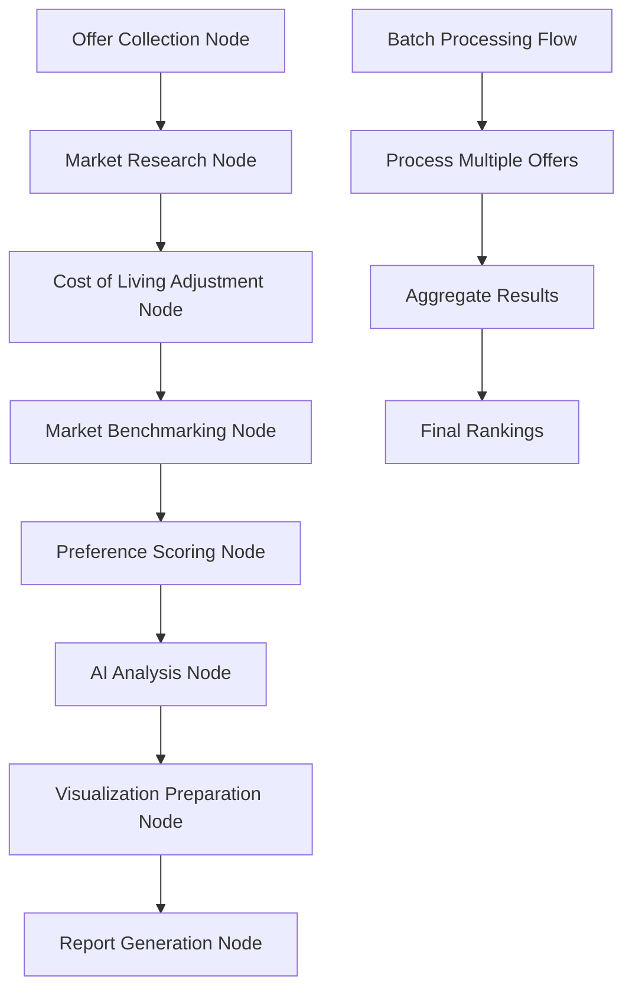

# Design Doc: OfferCompare Pro - Intelligent Job Offer Analysis Platform

## Requirements

### Core User Stories

1. **As a job seeker**, I want to input multiple job offers with comprehensive details (salary, equity, benefits, location, work-life balance metrics) so that I can compare them systematically.

2. **As a professional**, I want real-time cost of living adjustments across different locations so that I can make fair compensation comparisons.

3. **As a career-focused individual**, I want personalized recommendations based on my weighted preferences (salary vs growth vs work-life balance) so that I can make data-driven career decisions.

4. **As a negotiator**, I want market benchmarking data and insights so that I can understand my position and negotiate effectively.

5. **As a decision maker**, I want AI-powered analysis and risk assessment so that I can understand the long-term implications of each offer.

### Functional Requirements

- **Offer Input & Management**: Smart company autocomplete, comprehensive offer data collection, real-time validation
- **Cost of Living Analysis**: Location-based compensation adjustments, purchasing power parity calculations
- **Market Comparison**: Real-time salary benchmarking, position-specific ranges, percentile calculations
- **Personalization**: 11-factor weighting system, customizable preferences, dynamic scoring
- **AI Recommendations**: Multi-point analysis, risk assessment, career trajectory predictions
- **Visualization**: Interactive charts, comparison tables, radar charts for holistic view

## Flow Design

### Applicable Design Patterns:

1. **Map-Reduce Pattern**: 
   - *Map*: Process each offer through multiple analysis nodes (cost adjustment, market comparison, scoring)
   - *Reduce*: Aggregate all analysis results into final recommendations and rankings

2. **Agentic Data Collection**:
   - *Context*: Company name, position, location
   - *Action*: Intelligent web research and data extraction from multiple sources

3. **Pipeline Pattern**: Sequential processing of offers through validation → normalization → analysis → scoring → recommendation

### Flow High-Level Design:

1. **Offer Collection Node**: Collect and validate user input for multiple job offers
2. **Market Research Node**: Gather real-time market data and company insights using AI agents
3. **Cost of Living Adjustment Node**: Apply location-based compensation normalization
4. **Market Benchmarking Node**: Compare offers against industry standards and percentiles
5. **Preference Scoring Node**: Apply user-defined weightings to calculate personalized scores
6. **AI Analysis Node**: Generate comprehensive recommendations and risk assessments
7. **Visualization Preparation Node**: Prepare data for charts, tables, and visual comparisons
8. **Report Generation Node**: Create final comparison report with actionable insights



## Utility Functions

1. **Call LLM** (`utils/call_llm.py`)
   - *Input*: prompt (str), model_type (str)
   - *Output*: response (str)
   - Used by market research and AI analysis nodes

2. **Web Research Agent** (`utils/web_research.py`)
   - *Input*: company_name (str), position (str), research_topics (list)
   - *Output*: research_data (dict)
   - Intelligent web scraping and data extraction from Glassdoor, levels.fyi, Blind, LinkedIn, etc.

3. **Cost of Living Calculator** (`utils/col_calculator.py`)
   - *Input*: base_salary (float), from_location (str), to_location (str)
   - *Output*: adjusted_salary (float), adjustment_factor (float)
   - Calculates purchasing power parity adjustments

4. **Market Data Fetcher** (`utils/market_data.py`)
   - *Input*: position (str), location (str), experience_level (str)
   - *Output*: market_stats (dict) - percentiles, ranges, averages
   - Fetches real-time market compensation data

5. **Scoring Engine** (`utils/scoring.py`)
   - *Input*: offer_data (dict), user_preferences (dict)
   - *Output*: weighted_score (float), factor_breakdown (dict)
   - Calculates personalized scores based on user weightings

6. **Visualization Data Formatter** (`utils/viz_formatter.py`)
   - *Input*: processed_offers (list), comparison_type (str)
   - *Output*: chart_data (dict)
   - Formats data for Chart.js and interactive visualizations like Multi-Dimensional Analysis, etc.

7. **Company Database** (`utils/company_db.py`)
   - *Input*: company_name (str)
   - *Output*: company_data (dict) - culture metrics, benefits, growth potential
   - Maintains database of company information and metrics

## Node Design

### Shared Store

> Notes for AI: Try to minimize data redundancy

The shared store structure is organized as follows:

```python
shared = {
    "offers": [
        {
            "id": "offer_1",
            "company": "Google",
            "position": "Senior Software Engineer",
            "location": "San Francisco, CA",
            "base_salary": 180000,
            "equity": 150000,
            "bonus": 25000,
            "benefits_score": 8.5,
            "wlb_score": 7.0,
            "growth_score": 9.0,
            "culture_score": 8.0,
            "col_adjusted_salary": 165000,
            "market_percentile": 75,
            "total_score": 8.2,
            "ai_analysis": "Comprehensive analysis text..."
        }
    ],
    "user_preferences": {
        "salary_weight": 0.3,
        "equity_weight": 0.2,
        "wlb_weight": 0.2,
        "growth_weight": 0.15,
        "culture_weight": 0.1,
        "benefits_weight": 0.05
    },
    "market_data": {},
    "col_data": {},
    "final_rankings": [],
    "visualization_data": {},
    "ai_recommendations": {}
}
```

### Node Steps

1. **Offer Collection Node**
   - *Purpose*: Collect and validate comprehensive offer data from user input
   - *Type*: Regular Node
   - *Steps*:
     - *prep*: Initialize empty offers list in shared store
     - *exec*: Prompt user for offer details, validate data completeness and accuracy
     - *post*: Store validated offers in shared["offers"]

2. **Market Research Node**
   - *Purpose*: Gather real-time market intelligence for each company using AI agents
   - *Type*: Batch Node (processes multiple offers)
   - *Steps*:
     - *prep*: Read offers from shared store, extract company and position details
     - *exec*: Use AI agents to research each company (culture, recent news, employee satisfaction)
     - *post*: Enrich offer data with market research insights

3. **Cost of Living Adjustment Node**
   - *Purpose*: Normalize compensation based on location cost differences
   - *Type*: Batch Node
   - *Steps*:
     - *prep*: Read offers and user's base location preference
     - *exec*: Calculate cost of living adjustments for each offer location
     - *post*: Update offers with col_adjusted_salary and adjustment_factor

4. **Market Benchmarking Node**
   - *Purpose*: Compare each offer against industry market data
   - *Type*: Batch Node
   - *Steps*:
     - *prep*: Read offers and extract position/location/experience data
     - *exec*: Fetch market data and calculate percentiles for each offer
     - *post*: Add market_percentile and competitive_analysis to each offer

5. **Preference Scoring Node**
   - *Purpose*: Calculate personalized scores based on user-defined weightings
   - *Type*: Regular Node
   - *Steps*:
     - *prep*: Read offers and user preferences from shared store
     - *exec*: Apply scoring algorithm with weighted factors
     - *post*: Update offers with total_score and factor_breakdown

6. **AI Analysis Node**
   - *Purpose*: Generate comprehensive AI-powered recommendations and risk assessments
   - *Type*: Regular Node
   - *Steps*:
     - *prep*: Read all processed offer data and user preferences
     - *exec*: Generate detailed analysis using LLM with career trajectory predictions
     - *post*: Store ai_analysis for each offer and overall recommendations

7. **Visualization Preparation Node**
   - *Purpose*: Format data for interactive charts and comparison tables
   - *Type*: Regular Node
   - *Steps*:
     - *prep*: Read all processed offers and user preferences
     - *exec*: Generate chart data, comparison tables, and radar chart configurations
     - *post*: Store visualization_data in shared store

8. **Report Generation Node**
   - *Purpose*: Create final comprehensive comparison report
   - *Type*: Regular Node
   - *Steps*:
     - *prep*: Read all analysis results, rankings, and visualization data
     - *exec*: Generate structured report with recommendations and action items
     - *post*: Store final report and rankings in shared store

### Implementation Best Practices

**Critical PocketFlow Patterns (Based on Production Experience):**

1. **Error Handling**: 
   - ❌ **NEVER** use try/except in node execution
   - ✅ Let PocketFlow's built-in retry mechanisms handle failures
   - ✅ Defer exception handling to framework's fault tolerance

2. **Context Window Usage**:
   - ❌ **NEVER** crop text or limit input size arbitrarily  
   - ✅ Modern LLMs handle hundreds of thousands of tokens
   - ✅ Pass full offer data and company research to analysis nodes

3. **Shared Store Access**:
   - ❌ **NEVER** access shared store in `exec()` step
   - ✅ Only read in `prep()` and write in `post()`
   - ✅ Pass all needed data through prep → exec → post pipeline

### Batch Processing Design

For handling multiple offers efficiently:

```python
class OfferBatchNode(BatchNode):
    def process_batch(self, offers_batch):
        # Process multiple offers in parallel
        # NO try/except here - let PocketFlow handle errors
        results = []
        for offer in offers_batch:
            result = self.process_single_offer(offer)
            results.append(result)
        return results
```

### Async Integration

For external API calls (market data, web research):

```python
class AsyncMarketResearchNode(AsyncNode):
    async def async_exec(self, company_data):
        # Parallel API calls to multiple data sources
        # NO error handling - trust PocketFlow's mechanisms
        market_data = await self.fetch_market_data(company_data)
        company_info = await self.research_company(company_data)
        return {"market": market_data, "company": company_info}
```

### Node Implementation Pattern

**Correct Pattern:**
```python
class MarketResearchNode(Node):
    def prep(self, shared):
        # Only read from shared store
        return shared["offers"]
    
    def exec(self, offers):
        # Never access shared store here
        # Never use try/except here
        # Process full data without cropping
        research_results = []
        for offer in offers:
            research = self.research_company(offer["company"])
            research_results.append(research)
        return research_results
    
    def post(self, shared, prep_res, exec_res):
        # Only write to shared store
        for i, research in enumerate(exec_res):
            shared["offers"][i]["market_research"] = research
```

